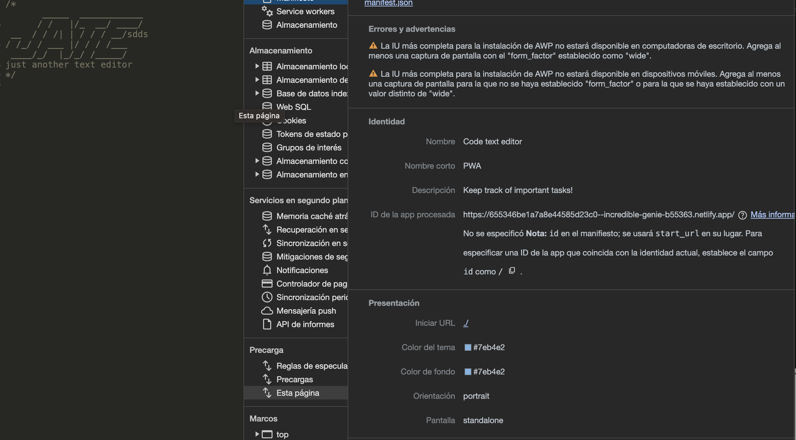

# Jate text editor
by cidherp2

## Table of Contents

*[Description](#description)

*[Installation-instructions](#installation)

*[Usage](#usage)

*[License](#license)

*[Contribution](#contribution)

*[Tests](#test)

*[Questions](#questions)
* [License](#license)

## Description
A code text editor that you can use offline so you can sketch your code ideas on the go !
## Installation-instructions
i'ts a deployed app, but in develop you run npm i and run  dev so you can work, then run build to bundle it 
## Usage
You are driving in a car with a cool sommer breeze caresing your hair when all of the sudden you have an amazing idea, so you whip out your lapto and go to town and you rest peacefully that knight knowing that your code ideas are gonna be there tomorrow morning

## License
ISC
## Contribution
there are none
## Tests
there are none
## Have any more questions?
You can reach me here
    Git Hub: cidherp2
    email: alexlarios70@hotmail.com
## License
        Licensed under the ISC license
